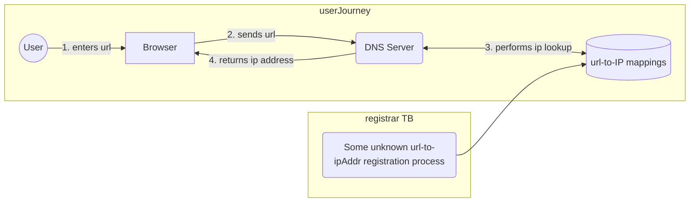

# Leveling Up on DNS

###### See my [Leveling Up: The Series](todo-add-link) post for some context on what this is all about.

## Context
As a member of an application development team, our focus is mostly on writing the code that serves up business value. However as Dev(Sec)Ops engineers, we need to understand more about how that code is packaged up, staged, run, and - most relevant to this post - _communicates_ with other entities over networks and interwebs.

One part of the communication bit has to do with what's called DNS. This was one of those things that, since it didn't impact me day-to-day, I have always been fine with "understanding" it from a high level. However, our org recently had a security audit done and it resulted in a bunch of priority work to reduce our attack surface area by tuning our network/s configuration/s, and this involved some changes to DNS. I felt like now would be a good time to level up my understanding of the topic.

## What I thought I knew about DNS
I'll stick to the context of a human working with an internet browser, trying to visit different websites, but this can all easily extend to machine-to-machine communication as well.

Okay. I was relatively confident that the following things were true going in...

* Computers that are capable of delivering web content (i.e. web servers) have an address. Just like physical addresses, if you want to talk to someone or interact with something physically, you go to their address (where they are) to do so. And just like office buildings or personal residences, most web applications have a _permanent_ address. To load a web page, you need to get your browser to go to the web server's address.
* Addresses for web applications or anthing that communicates over a network are called IP (Internet Protocol) addresses. They look like #.#.#.# where # can be anything from 0 to 255. 
* Series of numbers are not as much fun to memorize as human-readable names.
* Therefore, we pretend that things called hostnames are the same as a computer's address. Hostnames look like `www.blah.com`.
* The reality is, though, that a special service (which also has an IP address, of course), called a Domain Name Service or DNS, is responsible for _translating_ the human readable hostname into an IP address.
* To sum it up (again, this is what I _thought_), if I want to visit `www.blah.com`, I enter that "address" into my browser's address field and hit enter. Behind the scenes, the web browser reaches out to the DNS (the browser knows its IP address), and says "hey, what's the IP address for www.blah.com" and the DNS responds with 10.127.243.6. The browser then goes to 10.127.243.6 and says hello, where upon the server residing at 10.127.243.6 pushes a bunch of information to the browser, which it then renders as the website.

## Things I didn't know
What I didn't understand about DNS was ...

* _How_ is DNS able to do this for any web address I type in? Is there only one in the universe? If there are more than one, then what happens if my browser asks the wrong one to translate from hostname to IP address? Will I be lost, wandering in the desert? (Okay, I knew there wasn't only one but wasn't quite sure about division of responsibilities and how they cooperate with each other. If they even did.)
* As part of our security-related changes mentioned before, there was a lot of `A record` and `CNAME` talk going back and forth in conversations about making changes to our DNS. I reasoned that these were related to the mappings of hostnames to IP addresses, but I wasn't sure how they differed or if there were more types of these records. Maybe this is just a sub-point of the first bullet here.

## My mental map before diving deep
Here's an attempt at a mermaid diagram, which renders code into pictures. 

